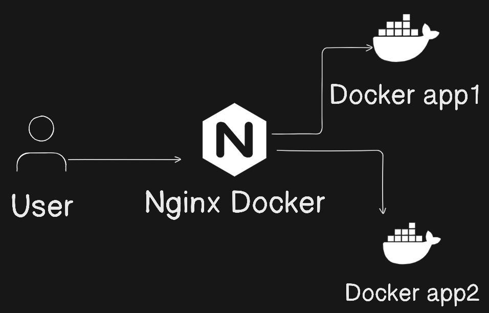

# nginx-reverse-proxy



This is a repository which shows how to setup nginx reverse proxy to route requests to different servers.

We will use docker containers to demonstrate this.

It consists of three nginx servers.

## Steps to follow

- Run docker-compose up

```
docker-compose up
```

- Go to localhost:8080/

- This delivers the main app

- Go to localhost:8080/app/

- Reload the app and it redirects to app1 and app2

## Read about it here

- [Read on HashNode](https://dipchak.hashnode.dev/nginx-reverse-proxy-using-docker)

- [Read on Medium](https://diptochakrabarty.medium.com/nginx-reverse-proxy-using-docker-8c3d0f00b27b)
